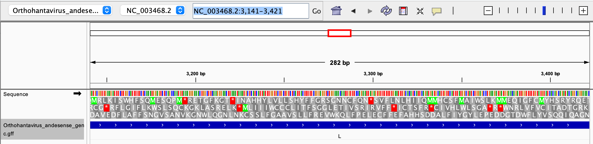
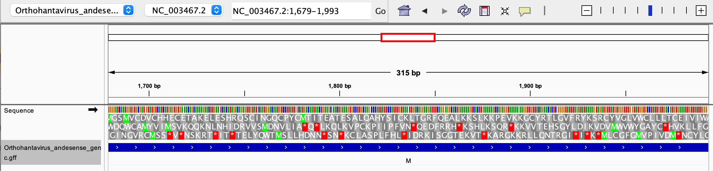
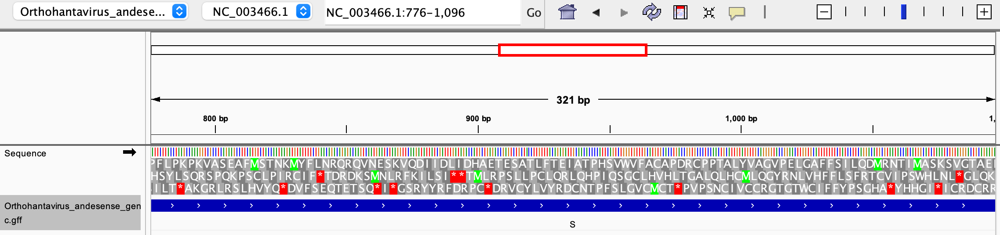

# *Orthohantavirus andesense* Genome Visualization

This project visualizes genomic data from *Orthohantavirus andesense* using IGV(Integrative Genomics Viewer). IGV  is a bioinformatics tool used to visually explore the large genomic datasets. 

## Prerequisites

* [IGV](https://igv.org/download/html/oldtempfixForDownload.html) installed locally.

## About *Orthohantavirus andesense*

* **Accession:** [NC_003467](https://www.ncbi.nlm.nih.gov/nuccore/NC_003467.2_)
* **Genome Size:** 12.1 kb
* **[Number of Annotiations](https://ftp.ncbi.nlm.nih.gov/genomes/all/GCF/000/850/405/GCF_000850405.1_ViralMultiSegProj14746/GCF_000850405.1_ViralMultiSegProj14746_feature_count.txt):** 8
* **Assembly Level:** Complete 
* Contains segmented viral genome made entirely of ribonucleic acid (RNA).
* **Significance:** Andes virus is the primary causative agent of Hantavirus Cardiopulmonary Syndrome (HCPS) and is uniquely notable among hantaviruses for documented person-to-person transmission.

## Visualizations

* Run the make file to download and unzip the necessary FASTA and GFF for genomic visualization.
* Locate the files in the directory ```datasets > fasta, gff```
* Open files in IGV and load FASTA (```Genomes > Load Genomes from File```) and GFF (```File > Load from File```) to visualize. 

## Observations
The genome of *Orthohantavirus andesense* is annotated seperately for different segments.

* **Large Segment**



* **Medium Segment**



* **Small Segment**



* In this genome, the genes are not "packed" in the traditional sense with measurable gene-to-gene gaps.
* Each of the three segments (L, M, and S, corresponding to NC_003468.2, NC_003467.2, and NC_003466.1) carries essentially a single gene that spans nearly the entire length of the segment, with only short untranslated regions at the ends. 
* Picking a coordinate such as NC_003468.2:3,281 on the L segment, IGV's sequence track shows the surrounding bases along with their translations. At that position, the three forward reading frames are displayed as three stacked rows of amino acids, while the three reverse frames would appear analogously if the view were flipped to the minus strand
* The gene is annotated on the plus strand, so only the forward frames are biologically relevant. 
* The data track beneath the sequence is a gene annotation track loaded from the GFF file, where each blue arrow-marked block represents one annotated gene feature. 

## References and Data Sources

1. Meissner, J. D., Rowe, J. E., Borucki, M. K., & St Jeor, S. C. (2002). Complete nucleotide sequence of a Chilean hantavirus. *Virus Research*, 89(1), 131–143. [https://doi.org/10.1016/S0168-1702(02)00129-6](https://doi.org/10.1016/S0168-1702(02)00129-6)

2. National Center for Biotechnology Information. *Orthohantavirus andesense* RefSeq Assembly. Accession: `GCF_000850405.1` (ViralMultiSegProj14746). [https://www.ncbi.nlm.nih.gov/datasets/genome/GCF_000850405.1/](https://www.ncbi.nlm.nih.gov/datasets/genome/GCF_000850405.1/)


