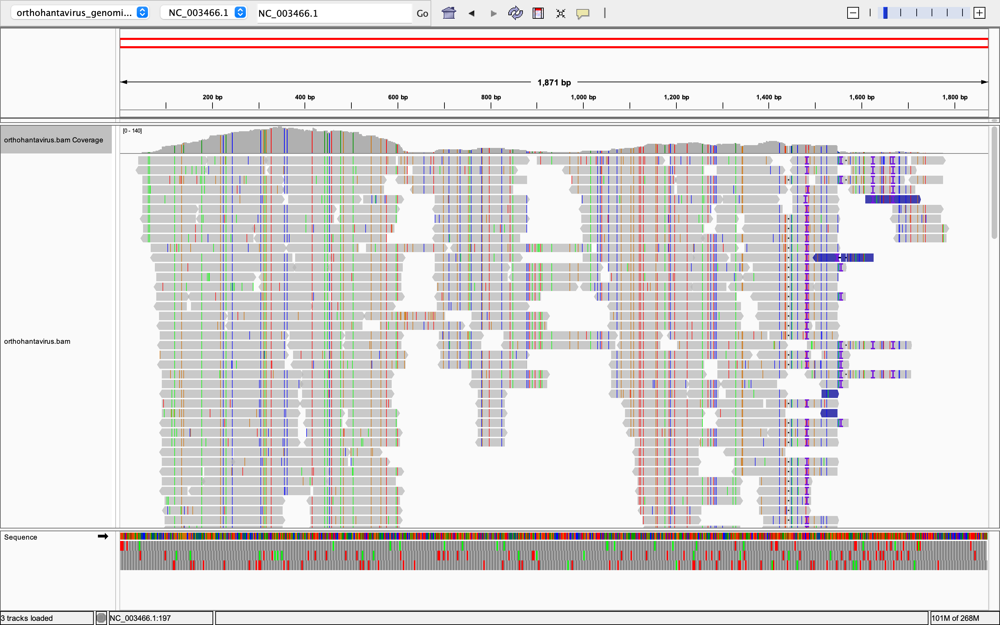

# Generate a BAM File

**Purpose:** Downloads a reference genome, downloads sequencing reads from SRA, and aligns the reads to produce a sorted, indexed BAM file — all via a single `Makefile`.

This pipeline targets **Illumina paired-end** short-read data (R1/R2 file pairs, aligned with `bwa mem`).

## Requirements

Make sure the following tools are installed and available on your `PATH`:

- `curl`
- [`sra-tools`](https://github.com/ncbi/sra-tools) (`prefetch`, `fasterq-dump`)
- [`bwa`](https://github.com/lh3/bwa)
- [`samtools`](https://www.htslib.org/)
- GNU `make`, `bash`, `awk`, `sed`, `gzip`

## Folder Layout

Running the pipeline creates the following structure:

```
.
├── Makefile
├── genome/
│   ├── <ORG_NAME>_genome.fna.gz
│   ├── <ORG_NAME>_genome.fna
│   ├── <ORG_NAME>_genome.fna.{amb,ann,bwt,pac,sa}   # BWA index files
│   └── .genome_size                                  # cached genome size in bp
├── fastq/
│   ├── <ORG_NAME>_1.fastq.gz
│   ├── <ORG_NAME>_2.fastq.gz
│   ├── .num_reads                                    # cached read-pair estimate
│   └── .config_sig                                   # cached COVERAGE/READ_LEN/NUM_READS signature
└── align/
    ├── <ORG_NAME>.bam
    └── <ORG_NAME>.bam.bai
```

Files are renamed using your chosen `ORG_NAME` instead of the raw accession numbers.

## Configuration

Set these variables at the top of the `Makefile`, or override them on the command line (e.g. `make genome ORG_NAME=myvirus`).

| Variable | Description | Default |
|---|---|---|
| `Genome_Accession_Number` | NCBI RefSeq accession (e.g. `GCF_000850405.1`) | `GCF_000850405.1` |
| `Genome_Accession_Name` | Accession name used in the NCBI file path | `ViralMultiSegProj14746` |
| `ORG_NAME` | Organism label used to rename output files/folders | `orthohantavirus` |
| `SRR_ACCESSION` | SRA run accession to download reads from | `SRR34582745` |
| `COVERAGE` | Target sequencing coverage (X) used to estimate read count | `10` |
| `READ_LEN` | Average read length (bp) of your Illumina paired-end reads, used in the coverage → read-count formula | `190` |
| `NUM_READS` | Manual override for number of read pairs (skips auto-estimation if set) | *(empty — auto-estimated)* |

### How read count is estimated

Once the genome is downloaded, its size (bp) is calculated automatically. The number of read **pairs** needed to reach the target coverage is:

$$\text{reads} = \frac{\text{genome size} \times \text{COVERAGE}}{2 \times \text{READ\_LEN}}$$

You can bypass this and force an exact number of reads with:

```bash
make fastq NUM_READS=5000
```

### Determining `READ_LEN` from your own data

`READ_LEN` should reflect the **actual average length** of your Illumina reads, not just a generic assumption. The most reliable way to get this is from a FastQC report on your FASTQ files:

$$\text{READ\_LEN} = \frac{\text{Total Bases}}{\text{Total Sequences}}$$

For example, a FastQC report showing `Total Sequences = 10000` and `Total Bases = 1.9 Mbp` gives:

$$\text{READ\_LEN} = \frac{1{,}900{,}000}{10{,}000} = 190 \text{ bp}$$

An inaccurate `READ_LEN` won't break the pipeline — it will just cause the actual achieved coverage to be somewhat higher or lower than your `COVERAGE` target.

You can pass it directly at runtime instead of editing the default:

```bash
make fastq READ_LEN=190
```

### Automatic re-download when coverage/read-length settings change

`COVERAGE`, `READ_LEN`, and `NUM_READS` are plain Make variables, not files — by default, Make has no way to know they changed between runs, since it only tracks file timestamps. To work around this, the `fastq` target depends on a `check-config` step that runs on every invocation:

1. It builds a signature string from the current `COVERAGE-READ_LEN-NUM_READS` values.
2. It compares that signature to the one cached in `fastq/.config_sig` from the last run.
3. **If they differ:** it deletes `fastq/.num_reads`, which makes Make's normal dependency tracking treat the read-count estimate (and everything downstream — the FASTQ files) as stale, so they get recomputed and re-downloaded automatically.
4. **If they match:** nothing is touched, and unrelated `make all` re-runs won't trigger redundant FASTQ downloads.

This means you can safely do:

```bash
make all COVERAGE=20
```

...and it will correctly detect the coverage change and re-download FASTQ reads at the new depth, without needing `make clean` first.

## Usage

```bash
make genome   # download + decompress genome, compute genome size
make fastq    # detect config changes, estimate read count, download + rename FASTQ files
make align    # index genome, align reads with bwa, sort + index BAM
make all      # runs genome -> fastq -> align in order
make clean    # remove genome/, fastq/, and align/ directories
```

### Example: run the full pipeline with custom parameters

```bash
make all \
  Genome_Accession_Number=GCF_000850405.1 \
  Genome_Accession_Name=ViralMultiSegProj14746 \
  ORG_NAME=orthohantavirus \
  SRR_ACCESSION=SRR34582745 \
  COVERAGE=15 \
  READ_LEN=190
```

## Notes

- The pipeline uses Make's dependency tracking, so re-running `make all` only rebuilds targets whose inputs changed (e.g. changing the genome accession re-triggers the genome download and everything downstream).
- `COVERAGE`, `READ_LEN`, and `NUM_READS` changes are also detected automatically via the `check-config` signature check (see above), even though they aren't files.
- `make align` will automatically build the BWA index (`bwa index`) if it doesn't already exist.
- `make clean` removes **all** generated files/folders — the original `Makefile` is untouched.

## What percent of the reads align?
```bash
samtools flagstat align/orthohantavirus.bam
```
**Output**

```bash 
2420 + 0 in total (QC-passed reads + QC-failed reads)
2420 + 0 primary
0 + 0 secondary
0 + 0 supplementary
0 + 0 duplicates
0 + 0 primary duplicates
2350 + 0 mapped (97.11% : N/A)
2350 + 0 primary mapped (97.11% : N/A)
2420 + 0 paired in sequencing
1210 + 0 read1
1210 + 0 read2
2344 + 0 properly paired (96.86% : N/A)
2344 + 0 with itself and mate mapped
6 + 0 singletons (0.25% : N/A)
0 + 0 with mate mapped to a different chr
0 + 0 with mate mapped to a different chr (mapQ>=5)
```
**Intrepretation:** 97.11% mapped (2,350 of 2,420 total reads). Of those, 96.86% are "properly paired" 

## What do the alignments look like? Do the reads show errors or variations? Is the coverage uniform?

IGV Visualization



**Intrepretation:** In the alignment track, gray portions of the reads match the reference sequence, while colored bases mark mismatches that may reflect sequence variation or sequencing errors. Most mismatches appear to involve individual bases or short stretches. Coverage is uneven across the region shown: it is highest around 300–600 bp, drops sharply near 600 bp, and varies at lower levels across the rest of the region.