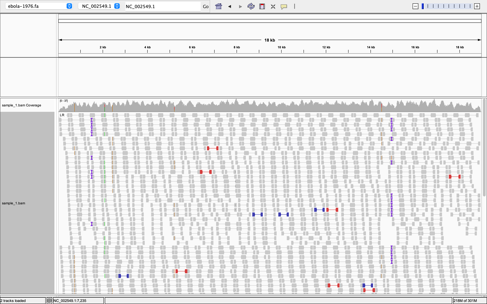
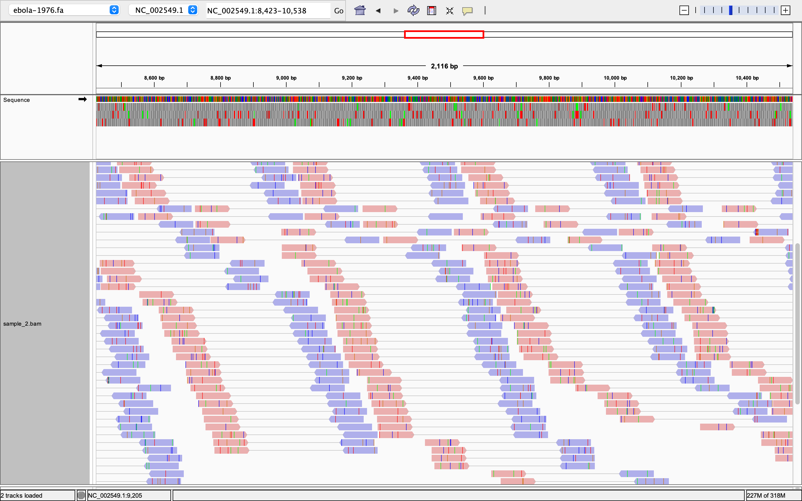
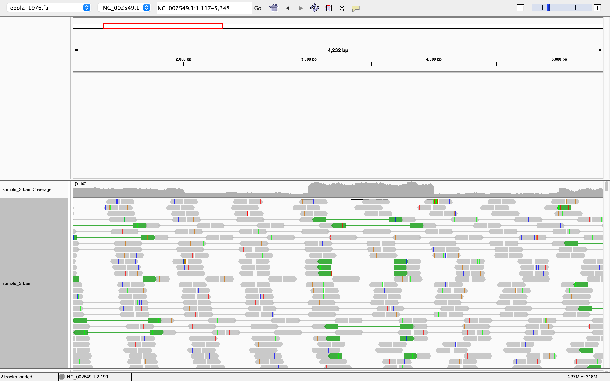
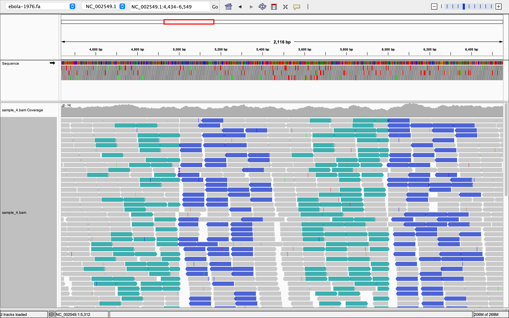
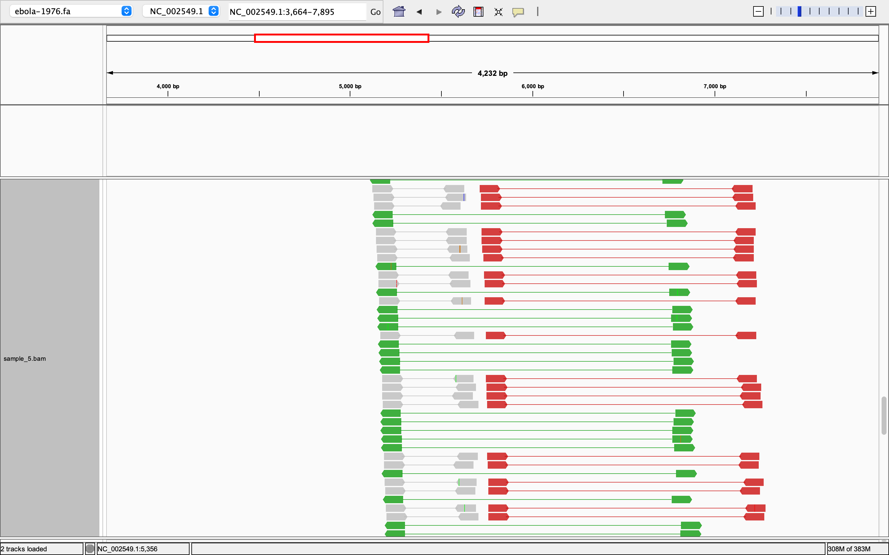

# Evaluate Structural Variants Using IGV 

This project uses Integrative Genomics Viewer (IGV) to explore paired-end read alignments and visually identify potential sequence and structural variants. Reads from five samples were aligned to the complete genome of [Zaire ebolavirus isolate Ebola virus](https://data.biostarhandbook.com/courses/2026-appbio/igv/fasta/ebola-1976.fa). The alignments were examined for base mismatches, unusual distances between paired reads, and unexpected read-pair orientations.

**Organism Accession:** NC_002549.1

## Samples BAM Files 

1. [Sample 1](https://data.biostarhandbook.com/courses/2026-appbio/igv/bam/sample_1.bam) 
2. [Sample 2](https://data.biostarhandbook.com/courses/2026-appbio/igv/bam/sample_2.bam)
3. [Sample 3](https://data.biostarhandbook.com/courses/2026-appbio/igv/bam/sample_3.bam) 
4. [Sample 4](https://data.biostarhandbook.com/courses/2026-appbio/igv/bam/sample_4.bam)
5. [Sample 5](https://data.biostarhandbook.com/courses/2026-appbio/igv/bam/sample_5.bam)

## Loading the Genome and Sample BAM files in IGV
 ```bash
 #Load Genome in IGV
 Genome -> Load Genome from URL

 #Load BAM files 
 Files -> Load From URL
 ```

## Observation and Intrepretation

### 1. Sample 1 
Sample 1 was displayed as paired reads and colored by insert size. Most pairs are gray, indicating that their inferred insert sizes fall within the expected range. A few red and blue pairs indicate larger-than-expected and smaller-than-expected insert sizes, respectively, but they do not form a clear cluster. There were **few insertion markers**, denoted by I. Overall, this sample shows **no obvious large structural variant except few insertion markers**.



### 2. Sample 2 
Sample 2 was displayed as paired reads and colored by read strand. The pink and purple read colors distinguishes two different read strand. Numerous colored bases within the reads represent mismatches to the reference. These mismatches may reflect single-nucleotide variants in the sample sequence, sequencing errors, or alignment artifacts. **A mismatch consistently supported by multiple high-quality reads is more convincing evidence of a true variant than an isolated mismatch.** 



### 3. Sample 3 
Sample 3 was displayed as paired reads and colored by insert size and pair orientation. Several green pairs have an outward-facing orientation, unlike the usual inward-facing orientation of standard paired-end reads. This indicates **copy number variation.**



## 4. Sample 4 
Sample 4 was colored by pair orientation. Clusters of turquoise reads point in the forward direction, while clusters of dark blue reads point in the reverse direction. Normally, paired-end reads align facing toward each other, however, these two colored pairs are pointing in the same direction. This indicates **a section of the sample’s genome is flipped compared with the reference, called an inversion. Read pairs of sample spanns on the edges of that flipped section, hence  align in these unusual directions in reference genome.**



## 5. Sample 5 
Sample 5 was displayed as paired reads and colored by insert size and pair orientation. The green pairs are outward-facing and span a much larger reference distance than the gray pairs. This indicates **inversion and deletion in sample genome.** 

The red pairs remain inward-facing but also span a much larger reference distance than the gray pairs. This pattern is consistent with a **possible deletion, fragments spanning a region absent from the sample align farther apart on the reference.**

