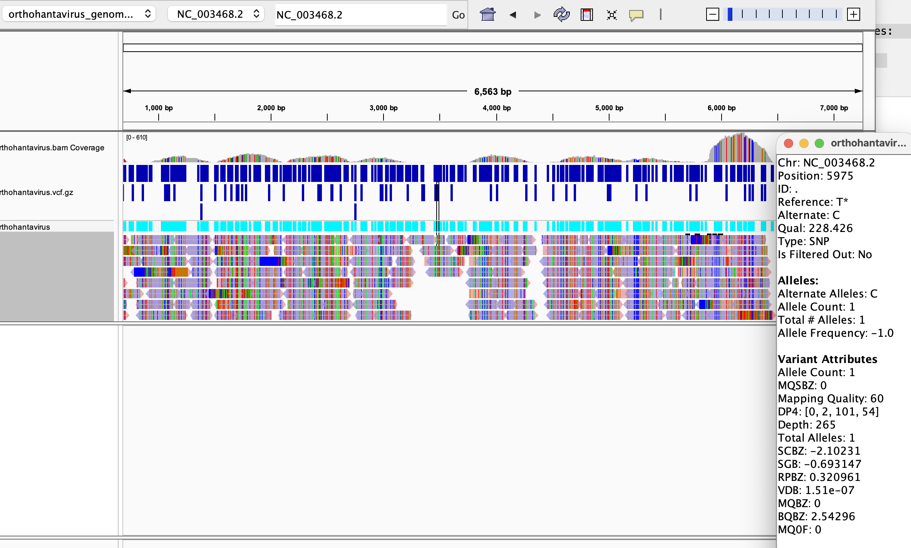
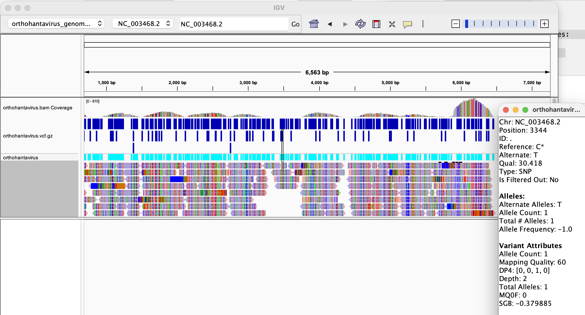

# Orthohantavirus variant-calling workflow

This project downloads a reference genome and paired-end sequencing reads, aligns the reads into a sorted BAM file, checks coverage, calls variants into an indexed VCF, and produces a VCF statistics report.

## Inputs

| Setting | Default | Purpose |
| --- | --- | --- |
| `Genome_Accession_Number` | `GCF_000850405.1` | Reference assembly accession |
| `Genome_Accession_Name` | `ViralMultiSegProj14746` | Assembly name used in the NCBI download URL |
| `SRR_ACCESSION` | `SRR34582745` | Sequencing run |
| `ORG_NAME` | `orthohantavirus` | Output filename prefix |
| `COVERAGE` | `10` | Requested coverage used to estimate read-pair count |
| `READ_LEN` | `50` | Estimated bases per read |
| `MIN_MEAN_DEPTH` | `10` | Minimum measured mean depth before variant calling |
| `PLOIDY` | `1` | Haploid variant-calling model |
| `NUM_READS` | Unset | Optional explicit read-pair count |

The workflow assumes paired-end reads and a haploid reference. Requested coverage is an estimate: read length, mapping rate, and available reads determine the measured depth.

## Setup and run

Use a terminal with Bash, Make, Conda, `curl`, and `gzip` available. Run all commands from the directory containing `Makefile` and `environment.yml`.

```bash
conda env create --prefix ./.bioinfo-env --file environment.yml
make check-tools
make all COVERAGE=30
```

The environment supplies SRA Toolkit (`prefetch` and `fasterq-dump`), BWA, SAMtools, and BCFtools. The Makefile automatically adds `./.bioinfo-env/bin` to PATH, so activating the environment is optional.

`COVERAGE=30` requests extra reads to provide a margin above the measured 10× threshold. It does not guarantee that the threshold will be met. Keep the same coverage setting on subsequent commands to avoid changing the cached read-count configuration.

## Workflow

1. Download and decompress the NCBI reference, then calculate its total length.
2. Estimate read pairs as `ceil(reference_length × COVERAGE / (2 × READ_LEN))`, or use `NUM_READS` if supplied. Extract paired FASTQ files and retain the first requested number of pairs.
3. Index the reference with BWA, align reads with `bwa mem`, and sort and index the BAM with SAMtools.
4. Measure depth with `samtools depth -aa`. Stop before variant calling if the mean depth is below `MIN_MEAN_DEPTH`.
5. Run `bcftools mpileup` and `bcftools call -mv --ploidy 1` to produce a compressed, variants-only VCF, then create its CSI index.
6. Run `bcftools stats` and print the summary-number (`SN`) records.

Individual stages are available as Make targets. Each builds its required upstream files:

```bash
make genome COVERAGE=30
make fastq COVERAGE=30
make align COVERAGE=30
make coverage COVERAGE=30
make check-coverage COVERAGE=30
make variants COVERAGE=30
make stats COVERAGE=30
```

`make coverage` displays the report; `make check-coverage` enforces the minimum depth. Existing outputs are generally reused based on their timestamps.

## Outputs 

Paths below use the default `ORG_NAME`.

| Output | Description |
| --- | --- |
| `genome/orthohantavirus_genome.fna` | Decompressed reference FASTA |
| `fastq/orthohantavirus_1.fastq.gz` | Subset of mate 1 reads |
| `fastq/orthohantavirus_2.fastq.gz` | Subset of mate 2 reads |
| `align/orthohantavirus.bam` | Sorted alignment |
| `align/orthohantavirus.bam.bai` | BAM index |
| `reports/orthohantavirus_depth.tsv` | Reference name, position, and depth for each base |
| `reports/orthohantavirus_coverage.txt` | Reference length, mean depth, and percentage of bases at least 10× |
| `variants/orthohantavirus.vcf.gz` | Compressed variant calls |
| `variants/orthohantavirus.vcf.gz.csi` | VCF index |
| `reports/orthohantavirus_vcf_stats.txt` | Full BCFtools statistics report |

## Variant Summary
* **Number of Variants Called: ```677 variants```**   
* **Kind of Variant: ```677 SNP```**  

```bash
>> Variant summary:
SN      0       number of samples:      1
SN      0       number of records:      677
SN      0       number of no-ALTs:      0
SN      0       number of SNPs: 677
SN      0       number of MNPs: 0
SN      0       number of indels:       0
SN      0       number of others:       0
SN      0       number of multiallelic sites:   0
SN      0       number of multiallelic SNP sites:       0
```

## VCF Output 
The majority of calls (QUAL ≥ 225) appear to be true variants, supported by very high quality scores and a Ts/Tv ratio of 9.92. A small subset of 20-25 variants (QUAL < 110, some with depth as low as 2-5x) are lower-confidence calls that could represent sequencing errors. 

**Representative High Quality Variant**


**Representative Low Quality Variant**


